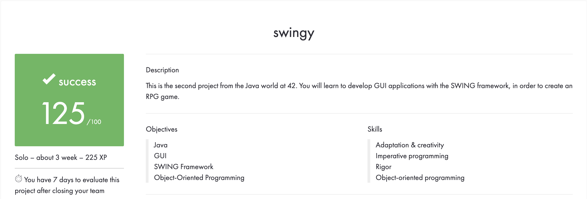

# SWINGY

## Prerequisites
* maven
* swing (java)

## Description
A GUI RPG game created using the SWING framework.

## Overall Achievements


## File Structure
```
swingy
│
│   README.md
│   asset-links.txt
│   pom.xml
│   
└───docs
│
│   swingy.en.pdf
│   overview.png
│
└───src
    │
    └───main
        │
        └───java
            │
            └───jde
                │
                └───agr
                    │
                    └───swingy
                        │
                        └───assets
                        │
                        └───constroller
                        │
                        └───database
                        │
                        └───model
                        │
                        └───Utility
                        │
                        └───view

                        Main.java
```
